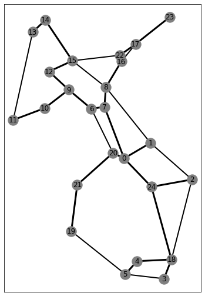
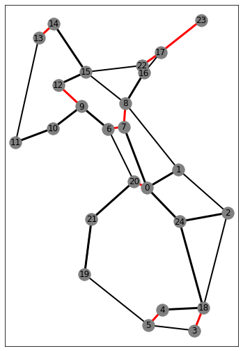
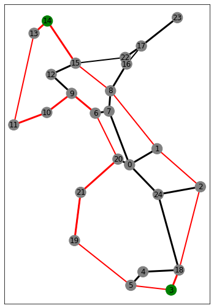

# eFRADIR

This is a repository for the eFRADIR journal paper.
It contains the data used in the simulations, the output of various steps and a simple example illustrating the operation of the framework.\

The contents of the folders:
- The **Network** folder contains the used networks in *.gml* format.
- The **SeismicData** folder contains the earthquake probability maps in *.csv* format.
- The **PSRLG** folder contains the results of the failure modelling, i.e. the PSRLGs and their probabilities.
- The **DisasterResilientNetworkUpgrade** folder contains the upgrade solutions of the 3 upgrade methods introduced in the paper.
- The **SimpleExample** folder contains an example illustrating the operation of the framework.

## Network
For each node the position is gived with the Latitude, Longitude coordinates.
For each edge the length, the initial unavailability (unav1), the unavailability after the spine upgrade (unav_final) and if the link is part of the spine (onspine) is given.

## SeismicData
Each row in the *.csv* files is corresponding to a physical position given by the first 2 columns. After that, the probability of an earthquake with a certain moment magnitude is given for that position. The moment magnitudes are listed in the first row.

## PSRLG
Each *.xml* file contains the output of the failure modelling for one network using the corresponding seismic data. Each PSRLG contains the SRLG (list of links) and the failure probability of the SRLG.

## DisasterResilientNetworkUpgrade
The disaster-resilient network upgrade results are given in case of the Interoute and janos-us networks for a range of TD and T values. The rows are the links of the network. The Links, Link Lengths and H0 columns contain the id, the length and the initial intensity tolerance of the links, respectively. The Delta H (...) columns contain the upgrade solutions and the H (...) columns contain the intensity tolerance values after the corresponding method's upgrade. Heuristic 1 is the Baseline Heuristic, Heuristic 2 is the Disconnection-Probability-based Heuristic algorithm from the paper.

## SimpleExample
The example illustrates the internal results of the framework in case of the Interoute network.
1. The result of the spine calculation is shown in the *spine.png* and the numerical results (spine selection and availability upgrade) are in the *Interoute.gml* as edge attributes.

2. The output of the failure modelling is the *Interoute_PSRLG.xml*.
3. The upgrade methods use the results of the failure modelling and the seismic data too, to find a sufficient solution. In this case the ILP was used to find the optimal solution for TD=0.005 . On *ilp_upgrade.png* the upgraded edges are colored to red, the *Interoute_TD0.0050_upgrade.csv* contains the exact upgrade levels.

4. The *Interoute_TD0.0050_T0.0005_ILP.srg* contains the network and the SRLGs with a probability higher than 0.0005 after the spine and disaster-resilient network upgrade. This is the input of the routing methods.

5. The *gdp-r.txt* contains the GDP-R routing solutions for many connections. The one between node 3 and node 14 is illustrated on the *gdp-r.png*. The source and target node are colored to green and the edges on the route are colored to red.

